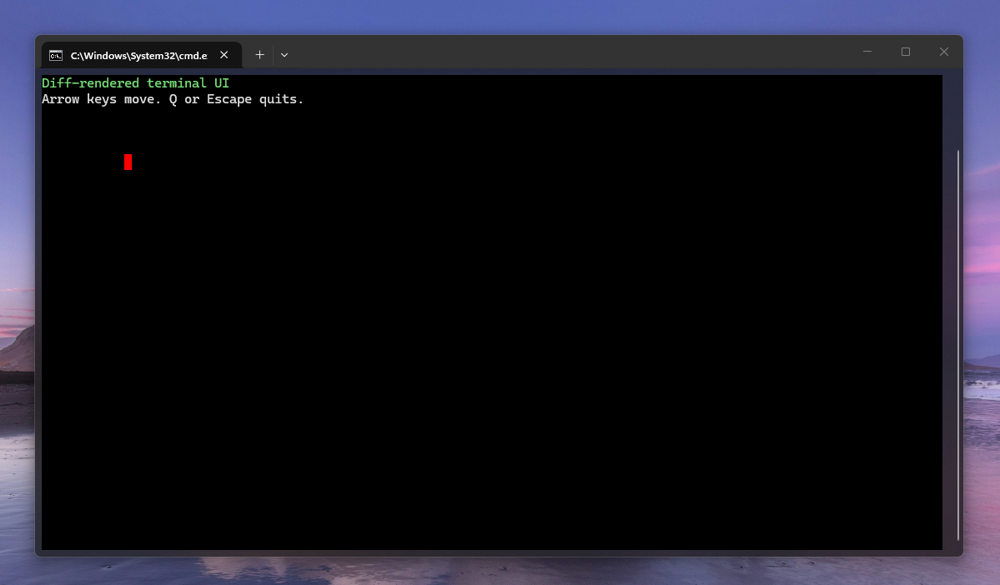

# term.h

Single-header C library for simple terminal UIs with colored cell rendering and keyboard input.



## Features

- Single-header distribution in `term.h`
- Colored cell-based rendering with diffed screen updates
- Keyboard input helpers for arrows, home/end, insert/delete, page keys, function keys, and modifier-aware input
- Terminal resize event support via `TKEY_RESIZE`
- Works on Win32 consoles and Unix-like terminals

## Files

- `term.h`: library interface and implementation
- `term_example.c`: small demo program
- `build.bat`: builds the Windows example with `gcc`
- `build_wsl.bat`: builds the example inside WSL (testing unix backend)

## Quick Start

In exactly one `.c` file:

```c
#define TIMPLEMENTATION
#include "term.h"
```

In other translation units:

```c
#include "term.h"
```

## Notes

- Text APIs use `wchar_t` and wide string literals like `L"text"`.
- Colors are packed with `TRGBA(r, g, b, a)` as `0xRRGGBBAA`. Alpha is preserved in the color value and currently ignored by terminal rendering.
- Use `tdefaultfg()` and `tdefaultbg()` when you want to render with the terminal's current default colors.
- The terminal backend expects a real console/TTY, not redirected stdin/stdout.
- `twait()` and `tpoll()` return the base key code. Call `tkeymods()` after each returned key to inspect `TKEY_MOD_SHIFT`, `TKEY_MOD_ALT`, and `TKEY_MOD_CTRL`.

## License

MIT. See `LICENSE`.
